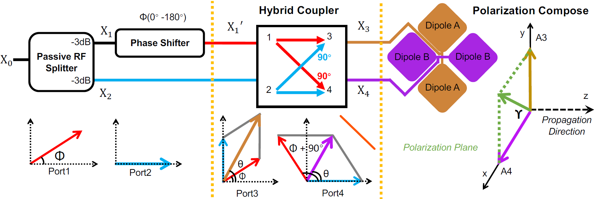

# MobiCom'24 Demeter

This repository provides the source design for our paper *"Reliable Cross-soil LPWAN with Low-cost Signal Polarization Alignment".* The system design of adjustable polarization with single RF chain is shown in this figure. For more details, please read our paper.

HFSS folder includes four folders about our hybrid coupler design: The initial design utilizes Rogers5880 substrate with 0.5mm. To reduce the cost for large scale deployment while achieving comparable performance, we optimize the design with FR4 of 1.6mm thickness with very low price. We publish our design on two different substrates. In addition, we also give the S parameters (4-port phase and amplitude changes/ratio) results of coupler illustrated by the core derived formula in **Section3.2** and **Section3.3**. 

Simulation software dependencies: Ansys Electronics Desktop 2023 | R2 MATLAB R2022b 

**Ansys Model**: The 3D high frequency simulation design.

**Export Data**: The simulation results exported from Ansys Electronics Desktop.

**MATLAB**: GUI code to illustrate S parameters of coupler.

**Figure**: The plotted figures by MATLAB code.

LoRa folder includes the code run on underground LoRa devices buried in soil. It is designed for how to modify the phase shifter value to adjust the linear polarization of the transmitter.

